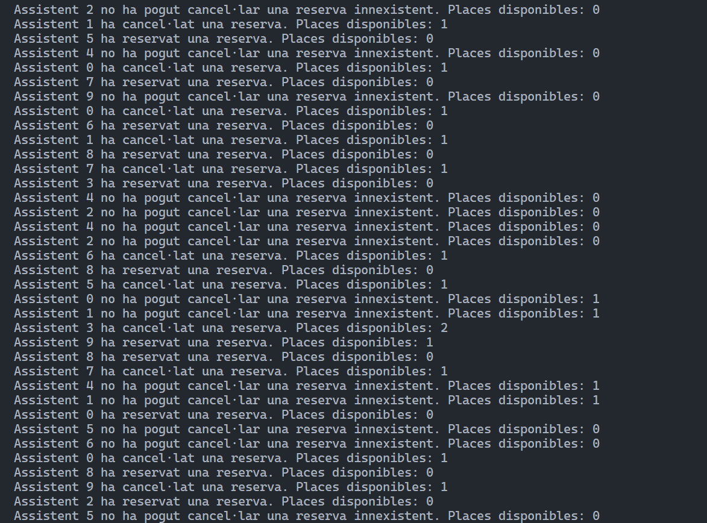

## Perguntes teòriques

### 1. Per què s'atura l'execució al cap d'un temps?
Perque els fils entren en wait() quan no hi ha places disponibles, i com que mai es crida notifyAll(), els fils queden bloquejats esperant a que algú els desperti. Això provoca que els fils es quedin en espera indefinida, aturant l'execució del programa.

### 2. Què passaria si en lloc de una probabilitat de 50%-50% fora de 70% (ferReserva)-30% (cancel·lar)? I si foren al revés les probabilitats? → Mostra la porció de codi modificada i la sortida resultant en cada un dels 2 casos

#### Fer reserva 70% i cancel·lar 30%:
``` java 
@Override
    public void run() {
        while (true) {
            try {
                Thread.sleep(random.nextInt(1000));

                if (random.nextInt(100) < 70) {
                    esdeveniment.ferReserva(this);
                } else {
                    esdeveniment.cancelaReserva(this);
                }
                
            } catch (InterruptedException e) {
                e.printStackTrace();
            }
        }
    } 
```


#### Fer reserva 30% i cancel·lar 70%:
``` java
@Override
    public void run() {
        while (true) {
            try {
                Thread.sleep(random.nextInt(1000));

                if (random.nextInt(100) < 30) {
                    esdeveniment.ferReserva(this);
                } else {
                    esdeveniment.cancelaReserva(this);
                }
                
            } catch (InterruptedException e) {
                e.printStackTrace();
            }
        }
    }
```





### 3. Perquè creus que fa falta la llista i no valdria només amb una variable sencera de reserves? 

